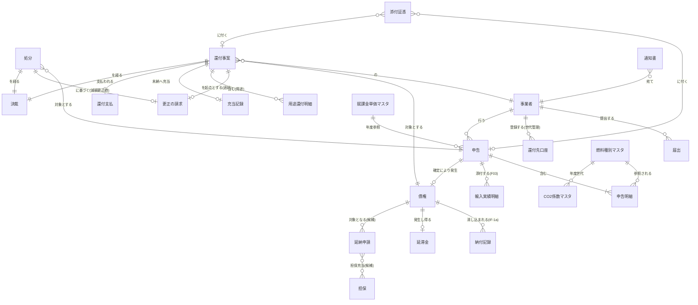

# データモデル(ドラフト): ER図とエンティティ定義

- 位置づけ: 業務仕様書(業務・帳票・画面)を受けた論理データモデル。政省令未確定のため属性は骨格レベル
- 記法: Mermaid ER図(GitHub上で描画可)。PK=主キー、FK=外部キー

## 1. ER図(主要エンティティ)

補足: 通知書(R01〜R12)は 処分・還付事案・延納申請 のいずれからも発行されるため、ER図では発行元を「発行元種別+発行元番号」のポリモーフィック参照とする(図では省略)。決裁も同様に対象を「対象種別+対象番号」で持つ。

## 2. 主要エンティティ定義

### 事業者(Operator)
| 属性 | 型 | 備考 |
|---|---|---|
| 事業者番号 | PK | 機構採番(F-XXXXXX) |
| 法人番号 | C(13) | 国税庁API照合済フラグを併持 |
| 名称/代表者/所在地 | C | |
| 事業区分 | K | 輸入/採取/両方 |
| 取扱燃料種別 | 多値→関連表 | |
| 状態 | K | 審査中/有効/廃止 |

### 還付先口座(RefundAccount)— 世代管理
| 属性 | 型 | 備考 |
|---|---|---|
| 事業者番号 | FK | |
| 世代番号 | PK(複合) | 変更届出のたびに新世代 |
| 金融機関/支店/種別/番号/名義 | C | |
| 適用開始日・終了日 | D | **還付支払時は支払決定日時点の有効世代を参照。変更後90日以内は追加確認フラグ** |

### 申告(Declaration)
| 属性 | 型 | 備考 |
|---|---|---|
| 申告番号 | PK | LV-YYYY-NNNNNN |
| 事業者番号 | FK | |
| 年度・期 | K | 期別は政省令待ち(月次仮置き) |
| 申告区分 | K | 当初/訂正(期限内) |
| 状態 | K | 状態遷移定義.md 参照 |
| 合計賦課金額 | N | 明細集計。**確定後は処分(更正)によってのみ変わる** |
| 適用単価(スナップショット) | N | 申告時点の単価マスタ値を保持(後の単価改定の影響を受けない) |

### 申告明細(DeclarationLine)
| 属性 | 型 | 備考 |
|---|---|---|
| 申告番号+行番号 | PK | |
| 燃料種別コード | FK | |
| 数量/単位 | N/K | |
| 控除数量 | N | 物量(数量と同一単位) |
| CO2係数(スナップショット) | N | 申告時点のマスタ値 |
| 賦課対象CO2量 | N | (数量−控除数量)×係数 |
| 賦課金額 | N | 賦課対象CO2量×単価 |

### 債権(Receivable)
| 属性 | 型 | 備考 |
|---|---|---|
| 納付番号 | PK | 機構採番(IF-1o 案Aの消込キー) |
| 発生元 | FK | 申告番号 or 処分番号(職権決定・増額更正) |
| 事業者番号 | FK | |
| 債権額(当初)/現在残高 | N | 残高=当初−納付累計(取消は逆仕訳) |
| 納期限 | D | 延納許可で上書き(上書き履歴を保持) |
| 状態 | K | 未納/一部納付/完納/過納検知(状態遷移定義.md) |

### 処分(Assessment: 決定・更正)
| 属性 | 型 | 備考 |
|---|---|---|
| 処分番号 | PK | |
| 種別 | K | 職権決定/増額更正/減額更正 |
| 対象申告番号 | FK | 職権決定はNULL可(無申告) |
| 更正前額/更正後額/差額 | N | |
| 起点 | FK | 更正の請求 受付番号(請求に基づく場合) |
| 決裁状態 | K | 起案/審査中/承認済/差戻し |
| 通知書文書番号 | FK | R03〜R05。**交付日=不服申立期間の起算** |

### 納付記録(PaymentRecord)— IF-1a由来
| 属性 | 型 | 備考 |
|---|---|---|
| 連携ID | PK | 冪等性キー |
| 納付番号 | FK | |
| 納付区分 | K | 本体/延滞金 |
| 納付日/納付額 | D/N | 納付日=延滞金確定・加算金起算の基準 |
| 取消フラグ/元連携ID | K/FK | 取消時は逆仕訳し債権状態を再計算 |

### 還付事案(RefundCase)
| 属性 | 型 | 備考 |
|---|---|---|
| RF番号 | PK | RF-YYYY-NNNN |
| 種別 | K | 過納(更正の請求起点/職権減額起点/納付超過)/用途 |
| 事業者番号/対象納付番号 | FK | |
| 請求額/認容額 | N | |
| 還付加算金 | N | 元本×利率(パラメータ)×日数/365。用途還付は原則0 |
| 充当額 | N | 未納債権への充当(充当記録へ明細) |
| 支払額 | N | 認容額+加算金−充当額 |
| 状態 | K | 状態遷移定義.md 参照(取消受信で「停止」あり) |

### マスタ(年度世代管理)
| マスタ | キー | 備考 |
|---|---|---|
| 賦課金単価 | 年度 | 政令番号・適用期間を保持。**過年度計算は納付年度時点の値を参照** |
| CO2係数 | 燃料種別×適用期間 | 政令別表想定 |
| 燃料種別 | コード | 単位を併持 |
| 用途区分 | コード | 政令減額用途(用途還付) |
| 業務パラメータ | キー | 期別・期限・利率・決裁閾値など政省令待ち項目の外出し先 |

## 3. 設計原則

1. **金額は再計算せず記録する**: 単価・係数は申告時点のスナップショットを明細に保持。マスタ改定が過去に波及しない
2. **債権残高はイベントソーシング的に導出**: 納付記録(取消含む)の累計から常に再計算可能にし、消込の逆仕訳に耐える
3. **世代管理**: 口座・単価・係数・納期限(延納上書き)は適用期間つき世代で持ち、「その時点で有効だった値」を監査可能にする
4. **ポリモーフィック参照は種別+番号で統一**: 通知書・決裁・添付証憑の発行元/対象
5. **候補業務(延納・担保)のエンティティは分離**: スコープ外になっても本体モデルに影響しない
