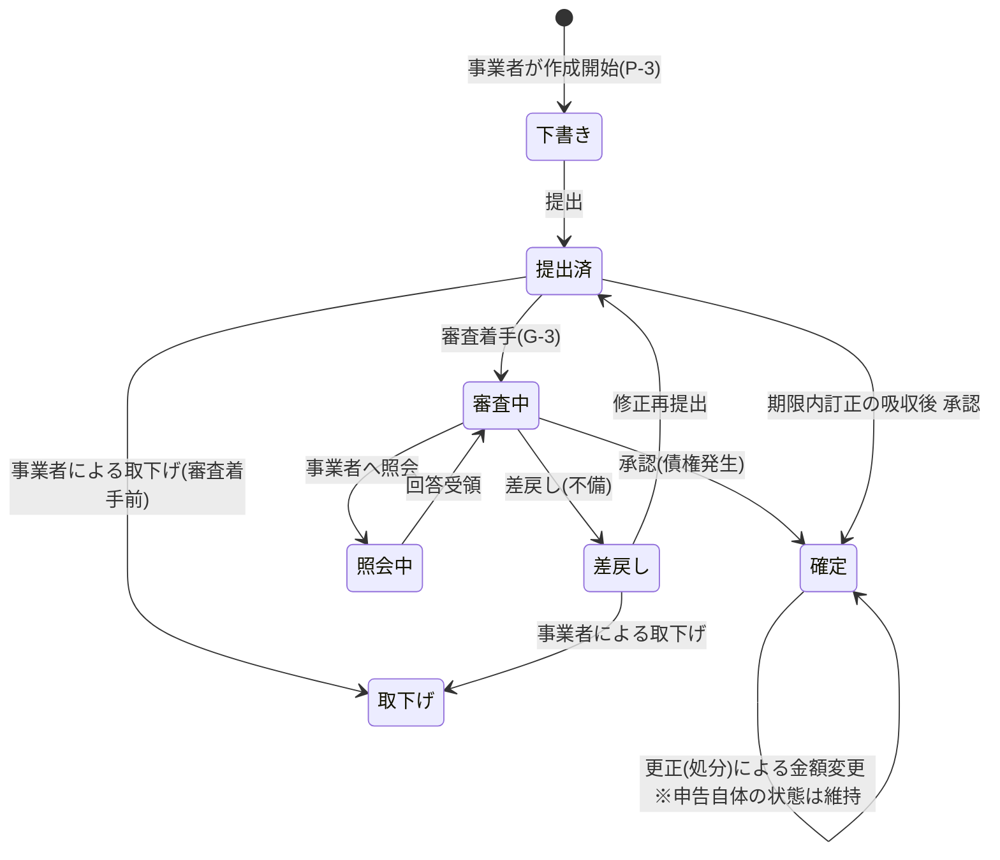
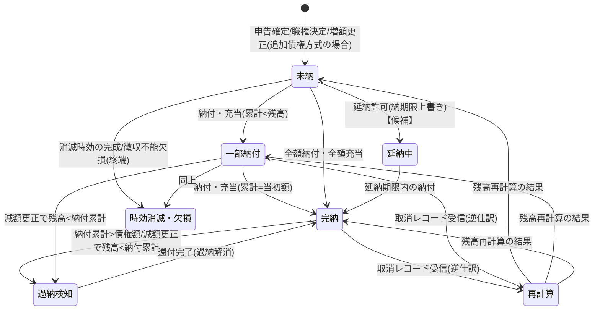
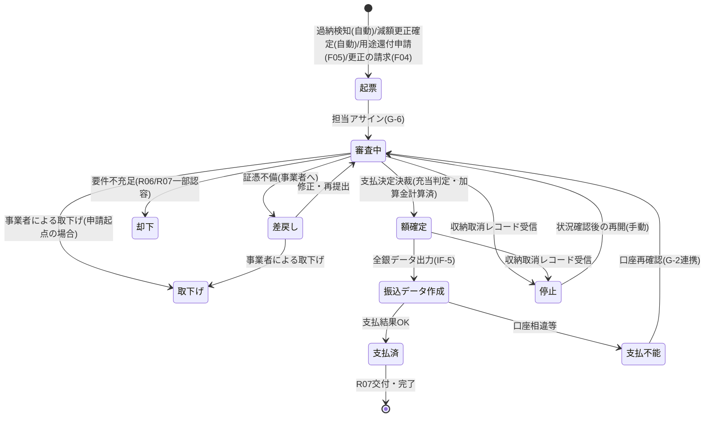
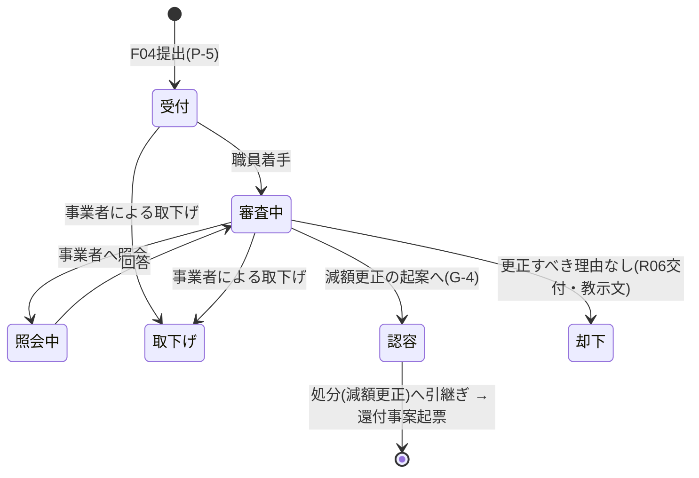
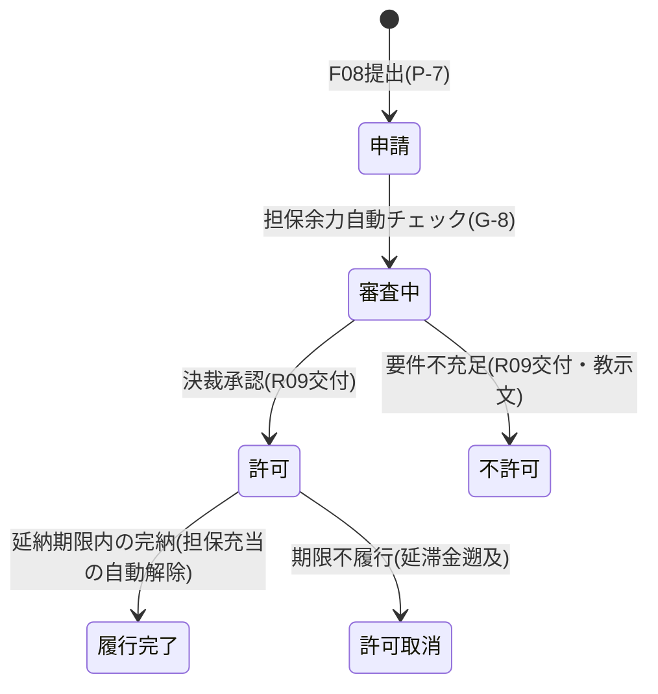
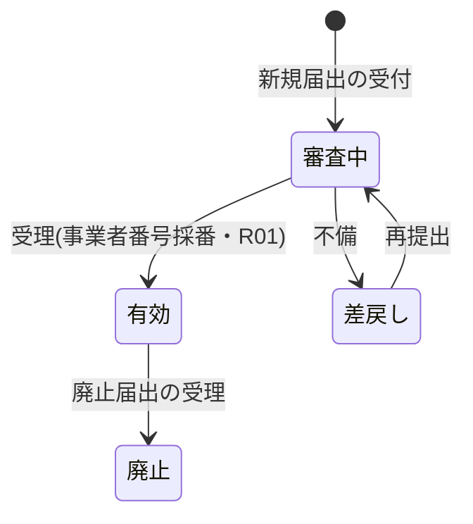
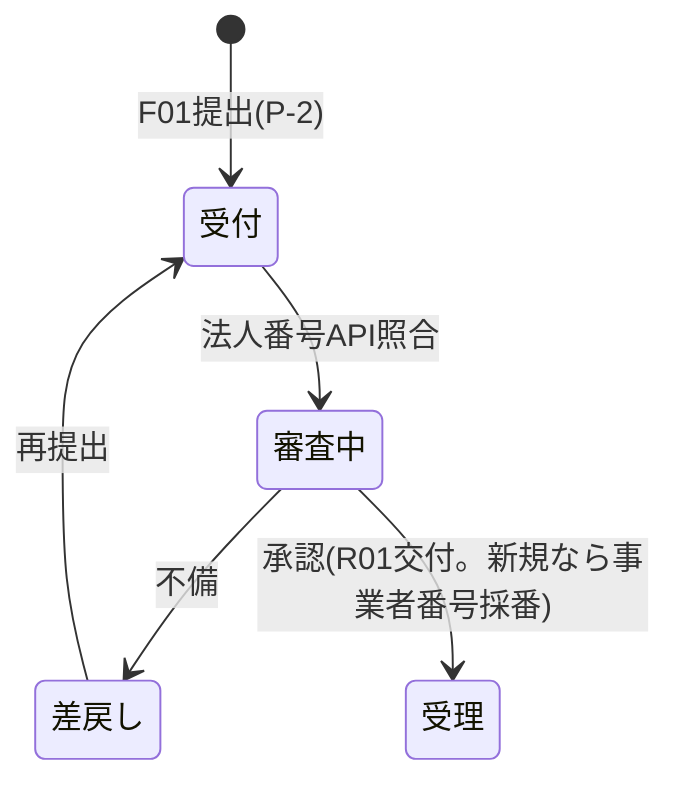

# 状態遷移定義(ドラフト): 申告・債権・還付・延納・事業者・届出

- 位置づけ: 画面モックに散在する状態表示(ピル)の正式定義。テスト観点書の入力
- 記法: Mermaid stateDiagram + 遷移表(トリガー/ガード条件/アクション)

## 1. 申告(Declaration)

| 遷移 | トリガー | ガード | アクション |
|---|---|---|---|
| 提出済→審査中 | 職員の審査着手 | — | 自動チェック(形式・係数・突合)実行 |
| 審査中→確定 | 承認決裁 | 突合差異が解消済みか説明可能 | **債権を発生**させ納付番号採番、IF-1o連携、R02交付 |
| 審査中→差戻し | 差戻し操作 | — | R08交付、事業者へ通知 |
| 確定後の金額変更 | 処分(職権決定/増額更正/減額更正) | 決裁承認済 | 債権の洗い替え(増額=追加債権 or 残高変更、減額=過納検知判定)、R03〜R05交付 |

※無申告の場合は申告エンティティを経由せず、処分(職権決定)から直接債権が発生する。

## 2. 債権(Receivable)

※「再計算」は疑似状態(遷移の分岐点)。取消受信時の着地点は金額次第で複数あり、**状態は常に納付・充当・取消の累計から再計算して決める**(横断ルール1)。時効の期間・起算日・完成猶予(不服申立て等による中断/停止)は政省令・機構規程待ち(課題#21)。

| 遷移 | トリガー | ガード | アクション |
|---|---|---|---|
| →一部納付/完納 | IF-1a 納付記録取込 | 連携ID未使用(冪等) | 消込、納期限超過なら延滞金確定計算 |
| →一部納付/完納 | **充当記録の作成**(還付事案の額確定時) | 同一事業者の未納債権 | 充当額ぶん残高減、状態再計算 |
| →過納検知 | 消込時判定/減額更正確定 | 納付累計>現在残高 | **還付事案(過納)を自動起票**(G-6ワークリスト) |
| 取消レコード | IF-1a 取消フラグ=1 | 元連携IDが存在 | 逆仕訳・状態再計算。**進行中の還付事案があれば「停止」へ** |
| →延納中 | 延納許可決裁(D-3) | 担保余力≧延納額(担保要件がある場合) | 納期限上書き(履歴保持)、IF-1o変更連携 |

## 3. 還付事案(RefundCase)

| 遷移 | トリガー | ガード | アクション |
|---|---|---|---|
| 起票 | 4起点(過納自動2種/用途申請/更正の請求) | 過納還付は減額更正の確定が前提(更正の請求起点の場合、処分の承認決裁を待つ) | RF番号採番 |
| →額確定 | 支払決定決裁 | ①未納債権への充当判定済 ②口座が有効世代 かつ **変更後90日以内なら追加確認済**(G-2の追加確認フラグ) ③二重支払なし | 加算金計算(納付日翌日起算・パラメータ利率)、充当記録作成(→債権残高の再計算) |
| →停止 | IF-1a取消受信 | 対象納付番号が当該還付の原資 | アラート、支払中断。**支払済み後の取消は回収事案として別管理** |

## 4. 更正の請求(CorrectionRequest)

## 5. 延納申請(DeferralApplication)【候補】

※許可取消は行き止まりにしない: 対象債権は「未納」(元の納期限基準で延滞金を遡及計算)へ戻し、滞納整理(部門連携)と担保処分の検討へ接続する(督促状発行は本システム対象外だが、対象の抽出と連携は行う)。

## 6. 事業者(Operator)

※**変更届出の審査中も事業者本体の状態は「有効」のまま維持する**(住所変更等の審査が申告受付・還付をブロックしない)。変更内容は届出(§7)側の状態で管理し、受理時点で事業者・口座マスタへ反映(口座は新世代作成)。廃止時は未納債権・進行中還付の残処理が完了するまで論理削除しない。

## 7. 届出(Notification)

## 8. 横断ルール

1. **状態はイベントから導出可能に**: 特に債権は納付記録(取消含む)・充当記録の累計から常に再計算できること(消込の逆仕訳・監査対応)
2. **「停止」は還付にのみ存在**: 金銭流出側の安全弁。自動遷移は停止方向のみ、再開は必ず手動+決裁
3. **処分(決定・更正)は状態を持つ独立エンティティ**: 申告・債権の状態と混同しない(申告は「確定」のまま、処分が金額を動かす)
4. 画面のピル表示名は本定義の状態名と一致させる(モック側の「還付額確定」=本書「額確定」等の表記ゆれは実装時に本書へ寄せる)
